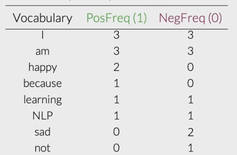
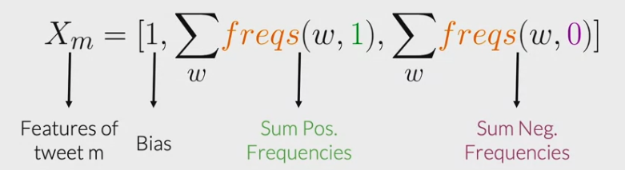

# Logistic Regression
## Vocabulary & Feature Extractions

For example, a tweet "I am happy because I am learning NLP. I hated the movie."

First create a vector V of unique words in the tweet, where V corresponds to the vocabulary size. For the tweet "I am happy because I am learning NLP", then put a 1 in the corresponding index for any word in the tweet, and a 0 otherwise.
`V=['I', 'am', 'happy', 'because', 'learning', 'NLP', 'hated', 'the', 'movie']`
Each word only appears once in the vector.

Feature extraction for tweet "I am happy because I am learning NLP". The number of features will equal to the size of entire vocabulary. **This will result to long training time and long prediction time.**
```
I -> 1
am -> 1
happy -> 1
because -> 1
learning -> 1
NLP -> 1
hated -> 0
the -> 0
movie -> 0
```

## Use word count as features in the logistic regression.
Given a word, keep track number of times the word appears in the positive/negative class.

Positive tweets:
- I am happy because I am learning NLP
- I am happy
Vocabulary for positive tweets will be:
```
I - 3
am - 3
happy - 2
because - 1
learning - 1
NLP - 1
sad - 0
not - 0
```

Negative tweets:
- I am sad, I am not learning NLP
- I am sad
Vecabulary for negative tweets will be:
```
I - 3
am - 2
happy - 0
because - 0
learning - 1
NLP - 1
sad - 2
not - 1
```


## Feature Extraction
Freqs: dictionary mapping from (word, class) to frequency




# end of script
