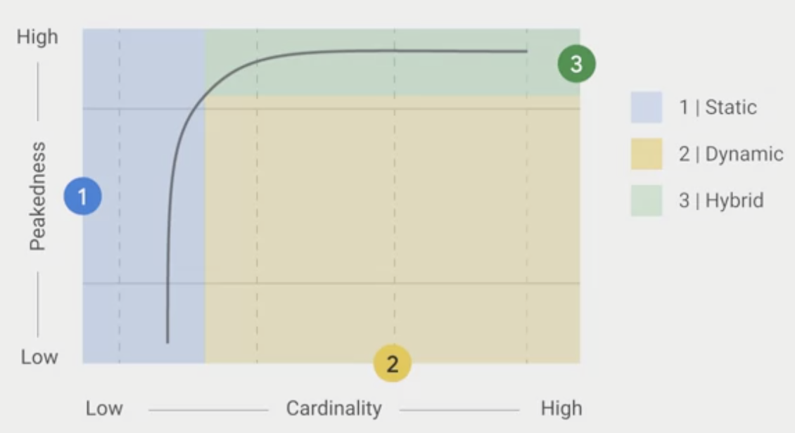

## Training design decisions
### Static training
Acquire data -> Transform data -> Train model -> Test model -> Deploy model
- Simpler to build and test
- Likely to become stale

### Dynamic training
Doing above repeatedly as more data arrives
Acquire data -> Transform data -> Train model -> Test model -> Deploy model -> Acquire data
- Harder to build and test (new data may have bugs)
- Will adapt to changes
- Harder engineering because we need:
  1. Monitoring
  2. Model rollback
  3. Data quarantine capabilities

If the relationship we're trying to model is one that's constant like physics, then a **statically trained model** may be sufficient.

If the relationship we're trying to model is one that changes, then the **dynamically trained model** might be more appropriate.

Most of the time you might need dynamic, but you might want to start with static because it's simpler.

## Serving design decisions
### Static serving
Computes label ahead of time and serves by looking it up in the table.
- Space intensive
- Higher storage cost: pre-computed predictions with low fixed latency
- Lower maintenance

### Dynamic serving
Computes label on-demand.
- Compute intensive
- Lower storage cost
- Higher maintenance
- Variable latency

Those choice of whether to use static or dynamic serving is determined by considering how important costs are with regards to:
1. Latency
2. Storage
3. CPU

It can be hard to express relative importance of these 3 areas, it might be helpful to consider serving design through another lense:
1. Peakedness: how concentrated the distrbution of the prediction workload is. E.g. model predicts next word based on words typed is highly peaked because small number of words account for majority of words used. Model predicts quarterly revenue for all sales verticles will be run on same verticles with same frequency, so it will be flat.
2. Cardinality: number of values in a set, in this case the set is all possible things we need to predict for. Low Cardinality example: model predicts sales revenue given organisation division number. High Cardinality example, model predicts life time value for e-commerce platform because number of users and number of characteritics of each user are quite large.

