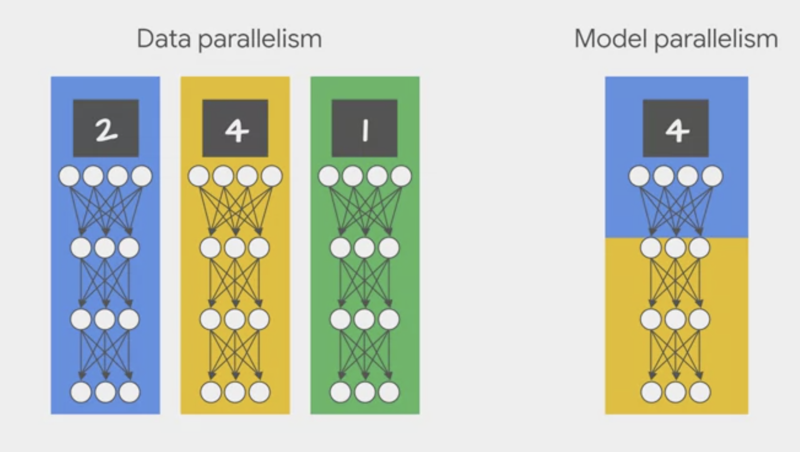
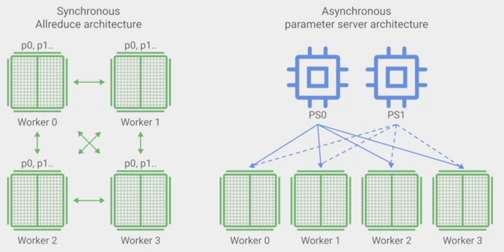

# Designing Adaptable ML systems

## Adapting to change

These often change:

- An upstream model
- A data source maintained by another team
  - To fix, we should stop consuming data from a source that doesn't notify downstream consumers.
  - Maintain a local version of the upstream model and keeping it updated
- The relationship between features and labels
- The distributions of inputs

## Features
- Features should always be examined before adding into the model
- All features should be subjective to leave-one-out evaluations to examine their importance

## Protect for feature & label distribution change
- Monitor
- Check residuals - difference between labels and predictions
- Emphasize data recency - treating more recent observations as more important by writing a custom loss function
- Retraining the model on most recent data

## Ablation analysis
Assess the value of a feature between comparing a model trained with a particular feature vs the model trained without it.

### Legacy features and bundled features
Legacy features: old features that were added because the were valuable at the time. Since then better features have been added which made them redundant without our knowledge.
Bundled features: features added as part of a bundle, which collectively are valuable but individually may not be.
Both features represent additional unnecessary data dependencies.

### Code smell
Introducing code that we're unable to inspect or easily modify into testing and production frameworks.

## Concept drift:
ML algorithm assumptions:
1. Instances are generated at random according to some probability distribution D
2. Instances are independent and identically distributed
3. D is stationary with fixed distributions

**Drift is the change in an entity with respect to a baseline**
Production can diverge or drift from the baseline data over time due to changes in the real world.

### Types of drift in ML models:
- Data drift: a change in P(X) is a shift in the model's input data distribution. E.g. incomes of all applicants increased by 5% but the economic fundamentals are the same.
- Concept drift: a change in P(Y/X) is a shift in the actual relationship between the model inputs and the output. E.g. macro economic factors make the lending riskier, and there is a higher standard to be eligible for a loan. A income was previously considered creditworthy is no longer creditworthy.
2 types of concept drift:
1. Stationary supervised learning: model trained only on historical data
2. Learning under concept drift: a new secondary data source is injected to provide both historical and new data to make prediction, the new data can be in batch or real time. Statistical properties of the target variable may change over time.

**Concept drift** occurs when the distribution of our observations shifts over time, or that the joint probability distribution changes.

4 types of concept drift:
- Sudden drift; a new concept occurs within a short time.
- Gradual drift: a new concept gradually replaces an old one over a period of time.
- Incremental drift; an old concept incrementally changes to a new concept over a period of time.
- Recurring concepts: an old concept may reoccur after some time.

- Prediction drift: a change in Y(y_hat|X) is a shift in the model's predictions. E.g. a large number of creditworthy applications when the production is launched in a more affluent area. Model still holds, but business maybe unprepared.
- Label drift: a change in P(Y Ground Truth) is a shift in the model's output or label distribution.

## Actions to mitigate concept drift
- Both data drift and concept drift lead to model drift
- Examples for data drift: changes in spamming behaviour, rule update in the app, selection bias, non-stationary environment
- Examples for concept drift: e-commerce apps (people’s preference do change), sensors (IOT), movie recommendation, demand forecasting (heavily relying on time, which is a major contributor to concept drift)

If diagnose data drift: enough of the data needs to be relabelled to introduce new classes and the model retrained
If diagnose concept drift: old data needs to be relabelled and the model needs to be retrained

## Design your system to detect changes

Once change detected, can:
1. Discard current model
2. Use existing state as a starting point for a better model, can update the model by using a most recent historical data
3. Use ensemble to train a new model in order to correct predictions from prior models. The prior knowledge learnt from the concept is used to improve the learning of the new concept. Ensemble learns the old concept with high diversity are trained with the low diversity on the new concept.

Tensorflow Data Validation: a library for validating machine learning data.

2 use cases:
- Validation of continuous arriving data
- Training/serving skew detection

To find problems in the data, common problems include:
- Missing data
- Labels treated as features
- Features with values outside an expected range
- Data anomalies

To engineer more effective feature sets, identify:
- Informative features
- Redundant features
- Features that vary so widely in scale that they may slow learning
- Features with little or no unique predictive information

Distribution skew: occurs when the distribution of feature values for training data is **significantly different** from serving data. Need to review if there is any difference between training and serving (prediction) data.

## Training & serving skew
The differences in performance that occur as a function of differences in environment:
1. A discrepancy between how you handle data in the training and serving pipelines
2. A change in the data between when you train and when you serve
3. A feedback loop between your model and your algorithm

## Diagnosing a production model
Q1: unversity-ranking, book-recommendation
Q2: prediction quality
Q3: Development and production environments are different
Q4: old concept that incrementally changes to a new concept over a period of time
Q5: Polylithic programs
Q6: Data Validation
Q7: Concept drift

# Designing High-Performance ML Systems
- Not all models are identical, for some models we focus on increasing on I/O performance, for others we focus on squeezing out more computational speed.
- Model training time
- Model training budget, may train faster on better hardware but hardware might cost more, may need to choose slightly slower infrastructure.

## 3 levers for training budget: time, cost and scale
- Can choose between training on a single more expensive machine or multiple cheaper machines. May need to write code differently.
- The larger the training data, the better the model performance, but there will be diminishing returns as the data gets larger. Time and cost budget may dictate the data set size.
- May have the choice of start training from an earlier model checkpoint and training just for a few steps. Converge faster than training from scratch each time.

## Tuning Performance to reduce training time, reduce cost, and increase scale
- Model training speed will be bound by one of the below:
  1. Input/output: how fast we can get the data into the model in each training step
  2. CPU: how fast we can compute gradient in each training step
  3. Memory: how many weights can we hold in memory so that we can compute matrix multiplication in memory or do we use GPU or TPU

| Constraints | Input/output | CPU | Memory |
| ----------- |------------| ---- | -------|
| Commonly Occurs | Large inputs   Input requires parsing  Small models| Expensive computations  Underpowered Hardware | Larger Number of inputs  Complex model |
| Take Action | Store efficiently  Parallelize reads  Consider batch size | Train on faster accelerator  Upgrade processor  run on TPUs  Simplify model | Add more memory  use fewer layers  Reduce batch size

## Prediction-time performance
- Batch prediction: very similar considerations with training performance.
  1. Time: how long does it take to do all predictions
  2. Cost: what are we predicting and how much do we pre-compute
  3. Scale: do we have to do this on a single machine or can do distribute it to multiple workers, what hardware are available on these workers
- Only prediction (streaming): different considerations because end user is waiting for the prediction
  1. Single machine: carry out the computation graph for one end user on one machine
  2. Microservice: almost always scale out prediction on multiple workers
  3. QPS: how many queries the model can handle in a second

When design for high performance, we need to consider training and prediction separately, especially in online predictions.

## Distributed training
The growth in algorithm complexity and data size means more complex models and large data volumes, distributed system is a necessity when it comes to machine learning.

### Distributed training architectures
2 types of distributed training architectures:

1. Data parallelism: model agnostic; run the same model and computation on every device but train each of them using different data samples. Each device computes loss and gradients based on training samples.

  - **Synchronous Allreduce architecture**: each worker device computes the forward and backward passes through the model on a different slice of the input data
    1) Each training node exchanges the gradients via an AllReduce operation at the end of each training iteration.
    2) The optimizer then performs the parameter updates with these reduced gradients, keeping the devices in sync.
    3) Because each worker cannot proceed to the next training step until all the other workers have finished the current step, this gradient calculation becomes the main overhead in distributed training for synchronous strategies.
    4) Synchronous approach should be considered for dense models (like BERT, Bidirectional Encoder Representations) which contain many features and thus consumes more memory.
  - **Asynchronous**: no device waits for the updates to the model from any other device. The device can run independently and share results as peers or communicate through one or more central servers known as parameter servers.
    1) Each worker independently fetches the latest parameters from the parameter servers and computes gradients based on a subset of training samples, it then sends the gradients back to the parameter server which then updates its copy of the parameters with those gradients.
    2) It scales well to a large number of workers where training workers may be pre-emptied by higher priority job, or a machine may go down for maintenance. This doesn't hurt scaling because workers are not waiting for each other.
    3) Downside is that workers can get out of sync, they compute parameters updates based on stale values and can delay convergence.
    4) Great for models use sparse data, contain fewer features, consume less memory and can run just a cluster of CPUs. For dense model, the parameter server transfers the whole model each step and this can create a lot of network pressure.

2. Model Parallelism: when the model is too big to fit on one device memory, we can divide it into smaller parts on multiple devices and then compute over the same training samples. It feeds every process the same data but supplies a different model to it. "Multiple program, same data". Multiple GPUs do not need to synchronise parameter values. Need special care when assigning different layers to different GPUs. Gradients obtained from each model are accumulated after a backward process, parameters and synchronised and updated.

end of script
