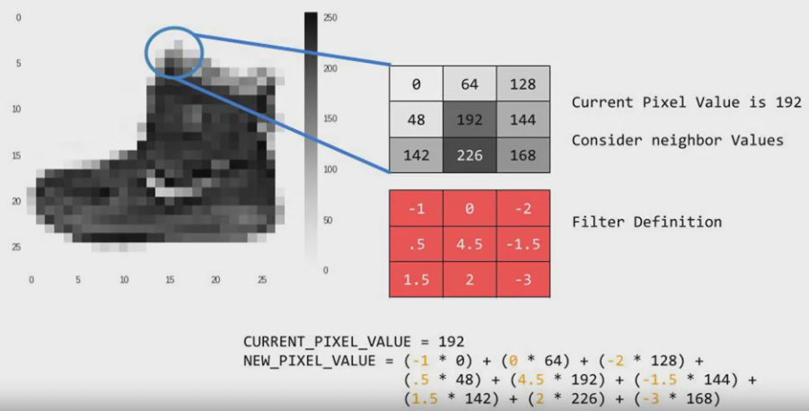
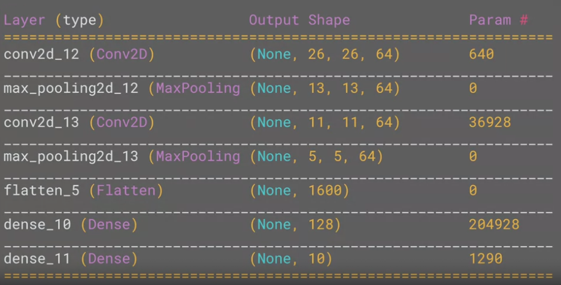

# Convolutions and pooling

### What is Convolution
It involves a filter and passing the image through the filter in order to change the underlying image.
- Take a pixel and look at its value and values of its neighbours.
- Multiply each neightbour by the corresponding value in the filter
- New pixel value is the sum of each of the neighbour values multiply by its filter value

Goal is that some convolutions will change the image such that certain features of the image get emphasised



### What is pooling
Pooling is a way to compress the image. Look at a pixel and its neightbours' value, keep the biggest value.


### Convolution and pooling implementation

```py
model = tf.keras.models.Sequential([
  tf.keras.layers.Conv2D(64, (3, 3), activation='relu', input_shape(28, 28, 1)),
  tf.keras.layers.MaxPooling2D(2, 2),
  tf.keras.layers.Conv2D(64, (3, 3), activation='relu'),
  tf.keras.layers.MaxPooling2D(2, 2),
  tf.keras.layers.Flatten(),
  tf.keras.layers.Dense(128, activation='relu'),
  tf.keras.layers.Dense(10, activation='softmax')
  ])
```

```py
tf.keras.layers.Conv2D(64, (3, 3), activation='relu', input_shape(28, 28, 1))
```
This code generates 64 filters, each filter is 3 by 3 with relu activation. Input is 28 by 28, with 1 byte for colour depth.

```py
tf.keras.layers.MaxPooling2D(2, 2)
```
Because it's max pooling, we're taking the maximum value of each 2 by 2 pixels.

Use `model.summary()` method to inspect the layers of the model.



Noting the each image is 28 by 28 pixels, but convolution layer only outputs 26 by 26 because we can't compute filter for the edge pixels of the photo. After the first 4 layers, the raw image will be converted into a convolution, which is what the neural network will be trained on.
