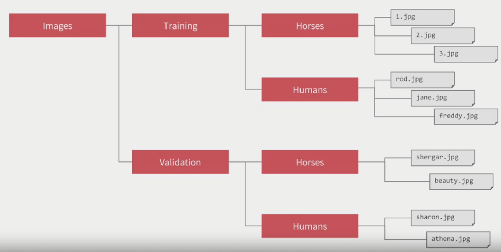
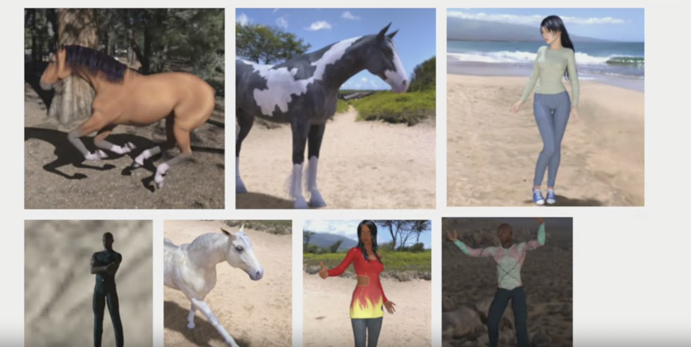

# Using real-world images

### ImageDataGenerator

A TensorFlow API that you can point it to a directory of images, and sub-directories of that will automatically generate labels for you.

For example if I point the ImageDataGenerator to the "Training" directory, the labels will be horses and humans, images in each directory will be loaded and labelled accordingly.




```py
from tensorflow.keras.preprocessing.image
import ImageDataGenerator

train_datagen = ImageDataGenerator(rescale=1./255)

train_generator = train_datagen.flow_from_directory(
  train_dir,
  target_size=(300, 300), # The resolution you want the images to be rescaled
  batch_size=128,
  class_mode='binary'
)
```


### ConvNet for complex images

Let's say we need to train a NN to classify human and horses, they could be in different orientation and sizes.



```py
model = tf.keras.models.Sequential([
  tf.keras.layers.Conv2D(16, (3, 3), activation='relu', input_shape=(300, 300, 3)),
  tf.keras.layers.MaxPooling2D(2, 2),
  tf.keras.layers.Conv2D(32, (3, 3), activation='relu', input_shape=(300, 300, 3)),
  tf.keras.layers.MaxPooling2D(2, 2),
  tf.keras.layers.Conv2D(64, (3, 3), activation='relu', input_shape=(300, 300, 3)),
  tf.keras.layers.MaxPooling2D(2, 2),
  tf.keras.layers.Flatten(),
  tf.keras.layers.Dense(512, activation='relu'),
  tf.keras.layers.Dense(1, activation='sigmoid')
])
```

- We have 3 sets of Convolution and pooling layer, this reflects the complexity and size of the images.
- We used sigmiod activation function with only 1 neuron, sigmoid is great for binary classification. In theory we can use 2 neurons with softmax activation function, but sigmiod is more efficient for binary classification.
