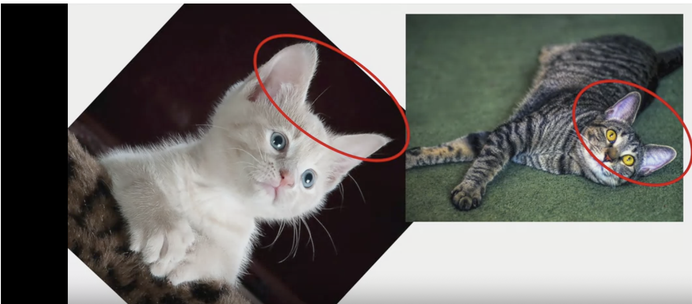
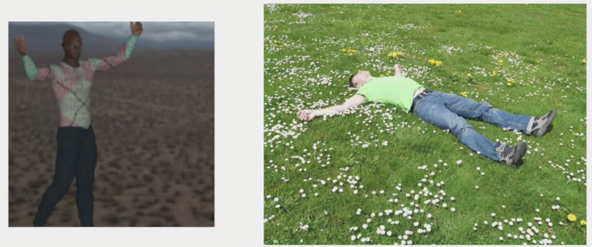
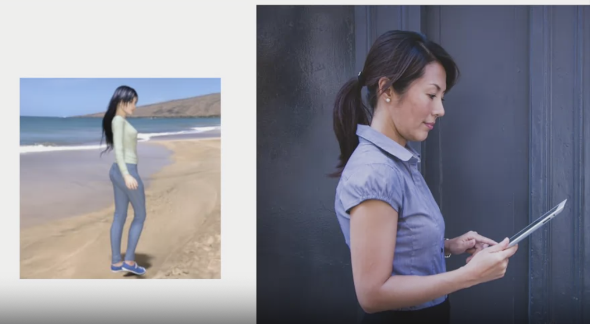
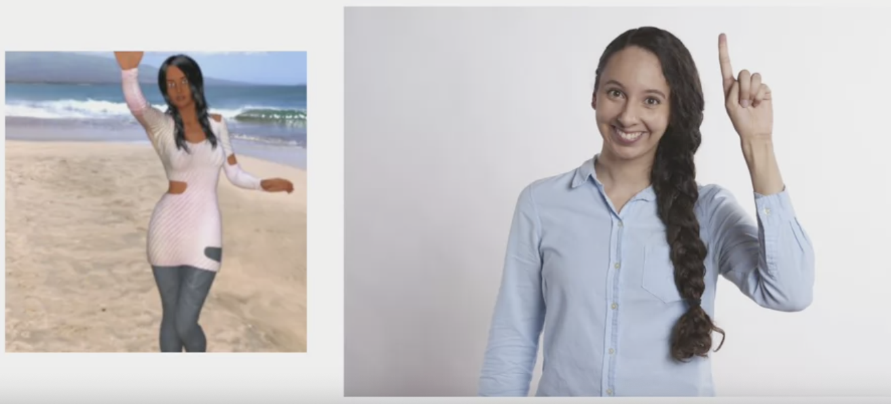

# Augmentation

### Image augmentation

Augmentation amends your images on-the-fly while training using transforms like rotation. So it could 'simulate' an image of a cat lying down by rotating a 'standing' cat by 90 degrees. As such we get a cheap way of extending your dataset beyond what you already have.

Keras has data augmentation layer, it doesn't require you to edit your raw images, nor does it amend them for you on-disk. It does it in-memory as it's performing the training, allowing you to experiment without impacting your dataset.

https://keras.io/api/layers/preprocessing_layers/image_augmentation/

If the model hasn't seen a cat reclining, only upright cats, it may not recognise reclining cats, but if we rotate the training image by 45 degrees, it may recognises reclining cats. Even if we don't have reclining cat, the upright cat when rotating could end up looking the same.



Previously we only rescaled the images:
```py
train_datagen = ImageDataGenerator(rescale=1./255)
```

There are a few other options that conert images on the fly:
```py
train_datagen = ImageDataGenerator(
  rescale=1./255,
  rotation_range=40,
  width_shift_range=0.2,
  height_shift_range=0.2,
  shear_range=0.2,
  zoom_range=0.2,
  horizontal_flip=True,
  fill_mode='nearest'
)
```

`rotation_range=40`: images will be rotated by a random amount between 0 and 40 degrees.
`width_shift_range=0.2`: shifting moves images inside the frame by proportion of the image size of 20%. Many pictures have the subject centred, if we train based only on these images, we might overfit for this scenario.
`shear_range=0.2`: shearing the image by up to 20%.



For example the images on the right, we may not have any pictures of that orientation, but if we shear the picture on the left by skewing along the x-axis, we'll end up in a similar pose.
`zoom_range=0.2`: sometimes zooming the picture may make it look a lot more similar to others, e.g. zooming picture on the left may make it look like the one on right. 0.2 is the relative portion that we will zoom in on, in this zoom a random amount up to 20% of the image size.



`horizontal_flip=True`: flipping the image horizontally. When set to `true`, images will be flipped randomly.



`fill_mode='nearest'`: fill pixels that might have been lost by the operations, in this case we fill using the nearest pixels, there are other fill methods.
